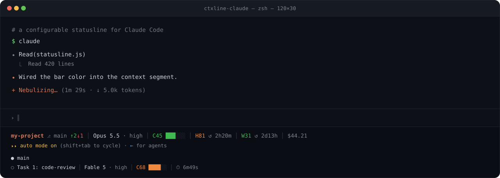

<p align="center">
  
</p>

<h1 align="center">Claude Code Statusline</h1>

<p align="center">
  A lightweight, zero-config statusline for Claude Code.
</p>

<p align="center">
  <a href="https://github.com/MithunWijayasiri/ctxline-claude/stargazers"><picture><source media="(prefers-color-scheme: dark)" srcset="https://www.shieldcn.dev/github/stars/MithunWijayasiri/ctxline-claude.svg?variant=secondary&amp;size=sm&amp;mode=dark"></picture></a>
  <a href="https://github.com/MithunWijayasiri/ctxline-claude/graphs/contributors"><picture><source media="(prefers-color-scheme: dark)" srcset="https://www.shieldcn.dev/github/contributors/MithunWijayasiri/ctxline-claude.svg?variant=secondary&amp;size=sm&amp;mode=dark"></picture></a>
  <a href="https://github.com/MithunWijayasiri/ctxline-claude/commits/main"><picture><source media="(prefers-color-scheme: dark)" srcset="https://www.shieldcn.dev/github/last-commit/MithunWijayasiri/ctxline-claude.svg?variant=secondary&amp;size=sm&amp;mode=dark"></picture></a>
  <a href="https://ko-fi.com/mithunwijayasiri"><picture><source media="(prefers-color-scheme: dark)" srcset="https://www.shieldcn.dev/badge/Ko--fi-support-FF5E5B.svg?logo=kofi&amp;variant=secondary&amp;size=sm&amp;mode=dark"></picture></a>
  <br>
  <a href="https://www.npmjs.com/package/ctxline-claude"><picture><source media="(prefers-color-scheme: dark)" srcset="https://www.shieldcn.dev/npm/ctxline-claude.svg?variant=secondary&amp;size=xs&amp;mode=dark"></picture></a>
  <a href="https://www.npmjs.com/package/ctxline-claude"><picture><source media="(prefers-color-scheme: dark)" srcset="https://www.shieldcn.dev/npm/dm/ctxline-claude.svg?variant=secondary&amp;size=xs&amp;mode=dark"></picture></a>
  <a href="https://www.npmjs.com/package/ctxline-claude"><picture><source media="(prefers-color-scheme: dark)" srcset="https://www.shieldcn.dev/npm/dt/ctxline-claude.svg?variant=secondary&amp;size=xs&amp;mode=dark"></picture></a>
</p>

<p align="center">
  
</p>

<p align="center">
  Monitor context usage, session limits, and weekly allowance without leaving Claude Code.
</p>

See your **current directory**, **active model**, **context window usage**, and **Claude usage limits** at a glance — including both your **current 5-hour session** and **weekly allowance**.

## Contents

- [Install](#install)
- [Uninstall](#uninstall)
- [What it shows](#what-it-shows)
- [Configuration](#configuration)
- [How it works](#how-it-works)
- [FAQ](#faq)

## Install

```bash
npx ctxline-claude     # or: bunx ctxline-claude
```

Then restart Claude Code or start a new session. That's it.

<details>
<summary>Other install methods</summary>

**Clone & run the installer:**

```bash
git clone https://github.com/MithunWijayasiri/ctxline-claude.git
cd ctxline-claude
./install.sh      # macOS / Linux
./install.ps1     # Windows (PowerShell)
```

**Manual:** download the script, then point `~/.claude/settings.json` at it.

```bash
curl -o ~/.claude/hooks/statusline.js https://raw.githubusercontent.com/MithunWijayasiri/ctxline-claude/main/statusline.js
chmod +x ~/.claude/hooks/statusline.js
```

```json
{
  "statusLine": {
    "type": "command",
    "command": "node ~/.claude/hooks/statusline.js"
  }
}
```

**Subagent rows.** The same script also renders per-task rows in the agent panel for running subagents — wire it as a separate `subagentStatusLine` command:

```json
{
  "subagentStatusLine": {
    "type": "command",
    "command": "node ~/.claude/hooks/statusline.js subagent"
  }
}
```

Note: the effort level only shows on a subagent row when that task has its own effort override — Claude Code doesn't currently report effort for a subagent that just inherits the session's setting.

</details>

## Update

```bash
npx ctxline-claude@latest
```

Re-runs the installer with the latest published version. Restart Claude Code or start a new session for the update to take effect.

## Uninstall

```bash
npx ctxline-claude uninstall
```

Removes the `statusLine` entry from `settings.json` (backed up first, other settings untouched), deletes the hook script, and clears the usage cache. If `settings.json` points at a different statusline, it's left alone.

<details>
<summary>Manual uninstall</summary>

Undo the two things the installer did — remove the `statusLine` block from `~/.claude/settings.json` (a timestamped `settings.json.backup.<n>` exists if you'd rather restore), then delete the script:

```bash
# macOS / Linux
rm ~/.claude/hooks/statusline.js
rm -f ~/.claude/cache/usage-cache.json   # optional: clears cached usage
```

```powershell
# Windows (PowerShell)
Remove-Item "$env:USERPROFILE\.claude\hooks\statusline.js"
Remove-Item "$env:USERPROFILE\.claude\cache\usage-cache.json" -ErrorAction SilentlyContinue
```

</details>

## What it shows

| Segment | Detail |
|---|---|
| **Directory** | Current working directory |
| **Branch** | Active git branch, with `↑N↓M` commits ahead / behind your upstream when it diverges |
| **Model** | Active Claude model (Opus / Sonnet / Haiku) |
| **Context** | Visual bar of context-window usage |
| **Current** | Live 5-hour session limit + reset countdown (subscription users) |
| **Weekly** | Weekly usage allowance + time until the weekly reset (subscription users) |
| **Model limit** | Weekly limit scoped to a single model, when your account has one — labelled by the model's initial (`F` = Fable) |
| **Cost** | Running session cost in USD (e.g. `$0.42`) |
| **Task** | The in-progress todo, when there is one |
| **Update** | An extra row with the upgrade command when a newer release is on npm — checked once a week, in the background |

> [!NOTE]
> Usage bars change color automatically as you approach your limits.

> [!NOTE]
> **Responsive.** On a narrow terminal the line wraps to two — directory, model, and context on the first line; usage, cost, and task on the second. Wide terminals stay on a single line. (Auto-sizing needs Claude Code v2.1.153+.)

> [!TIP]
> Don't want every segment? You can hide any of them — see [Configuration](#configuration).

## Configuration

The statusline is zero-config by default. To **hide segments you don't want**, set the `CTXLINE_DISABLE` environment variable to a comma-separated list of any of:

`branch` · `effort` · `cost` · `task` · `update` · `usage` (5-hour + weekly + model-scoped)

Directory, model, and context always show; unknown names are ignored. Example below hides cost and the current task.

### Option A — `settings.json` (recommended)

Works on every OS and survives restarts. Add a top-level `env` block to `~/.claude/settings.json` — Claude Code passes it to every command it spawns, including the statusline:

```json
{
  "env": {
    "CTXLINE_DISABLE": "cost,task"
  },
  "statusLine": {
    "type": "command",
    "command": "node ~/.claude/hooks/statusline.js"
  }
}
```

Restart Claude Code (or start a new session) to apply.

### Option B — shell environment

Set the variable **before** launching `claude` (the statusline inherits Claude Code's environment):

```bash
# macOS / Linux
export CTXLINE_DISABLE="cost,task"
claude
```

```powershell
# Windows (PowerShell) — this terminal only
$env:CTXLINE_DISABLE = "cost,task"; claude

# Windows — persist for future sessions (then open a NEW terminal)
setx CTXLINE_DISABLE "cost,task"
```

To re-enable a segment, remove it from the list (or delete the variable) and restart Claude Code.

## How it works

- **Source** — context comes from Claude Code's session data. The 5-hour and weekly bars are read straight from the `rate_limits` field Claude Code pipes in (no network), falling back to `https://api.anthropic.com/api/oauth/usage` when that field isn't present yet. API-key users skip usage entirely.
- **Model-scoped limits** — `rate_limits` carries only `five_hour` and `seven_day`, so a model-scoped weekly limit can only come from `/usage` (its `limits` array). It's served from the same cache as everything else, so this costs at most one call per 30s no matter how often the line renders.
- **No network on the fast path** — when `rate_limits` is in the session data, there's no API call at all. The fetch below only runs as a fallback (e.g. the first render of a session, before the field appears).
- **Adaptive timing** — for the fallback fetch: 1.5s timeout on the first prompt (cold start), 1.2s after (connection reused).
- **Caching** — the fallback fetch is cached at `~/.claude/cache/usage-cache.json`, shared across sessions. Within 30s the cache renders directly (the API call is skipped); if a live call fails, the last value (up to 10 min old) is shown so the bar never vanishes. The reset countdown recomputes every render.
- **Never breaks** — every failure path falls back silently; the statusline always prints.

## FAQ

<details>
<summary>Does it use extra tokens?</summary>

No — zero tokens, ever. The statusline is part of Claude Code's UI; its output is drawn in your terminal and is **never sent to the model**. Nothing it shows (context, usage, cost, git status) enters the conversation or counts toward your context window.

</details>

<details>
<summary>Does fetching data slow down Claude Code?</summary>

No, it's imperceptible. Almost every render reads a small local cache (sub-millisecond) instead of fetching. The usage API only runs as a fallback (and is cached); the git ahead/behind check runs at most once every ~5s and is hard-capped so it can never hang. The statusline runs as its own background command, so it never blocks your typing or Claude's responses — and in a non-git folder the git check doesn't run at all.

</details>

<details>
<summary>What is the ⬆ segment, and what does it send?</summary>

An extra row appears below the statusline — `⬆ update 1.7.0 · run: npx ctxline-claude@latest` — so the upgrade command is right there to copy. It shows only while you're behind, and the command works whichever way you installed. Once a week a short-lived background process asks the public npm registry for the package's latest version number and writes it to a local cache; the statusline itself only ever reads that cache, so no render waits on the network. The request carries nothing about you — no session data, no identifiers, just a plain GET for a public package. Hide it (and skip the request entirely) with `CTXLINE_DISABLE=update`.

</details>

<details>
<summary>Does this use the same data as /usage?</summary>

Yes — the same 5-hour and weekly limits. It reads them from the session data Claude Code provides when available, and falls back to Anthropic's usage API (the endpoint `/usage` uses) otherwise.

</details>

<details>
<summary>Is the session cost my actual bill?</summary>

It's the cost Claude Code computes for the session (tokens × per-model API pricing), read straight from the session data. For subscription (Pro/Max) users it's the *equivalent* pay-as-you-go API cost — useful as a gauge of session weight, but not what you're billed (you pay the flat subscription). It's an estimate, accurate to the extent your Claude Code pricing tables are current.

</details>

<details>
<summary>Does it work with API keys?</summary>

Yes. The statusline automatically detects subscription vs API-key usage.

</details>

<details>
<summary>Can it break Claude Code?</summary>

No. [Statuslines are a built-in Claude Code feature](https://code.claude.com/docs/en/statusline) — this provides the command Claude Code runs. All failures are handled silently and the statusline always renders.

</details>

<details>
<summary>Does it expose my API keys / auth tokens?</summary>

No. Your credentials never leave your machine. On the fast path no token is read at all — usage comes straight from the session data. Only on the fallback fetch is the OAuth token read locally (from `~/.claude/.credentials.json` or the macOS keychain), used solely to authenticate the request to Anthropic's own usage API — the same endpoint `/usage` uses. Nothing is sent to any third party, logged, or cached; only the resulting usage percentages are stored locally.

</details>


## Support

If you find this project useful, consider supporting its development on [Ko-fi](https://ko-fi.com/mithunwijayasiri). Your donations help keep the project maintained, improve existing features, and fund new open-source tools.

Thank you for your support! ❤️

## Credits

Thanks to [@TahaSabir0](https://github.com/TahaSabir0) for the base config.

## License

MIT